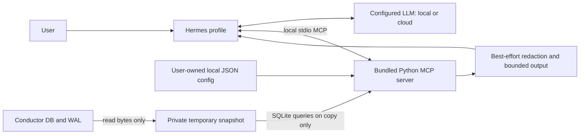

# Conductor Status Bot

A portable Hermes profile distribution that reports local Conductor session status
through one **local stdio MCP tool**. No remote MCP service, Conductor account
credentials, message sending, task mutations, or source SQLite connections.

## Architecture



The MCP server exposes only `conductor_status`, with an empty input schema and
`additionalProperties: false`. It rejects SQL, paths, commands, and unknown tools.
It never opens a listening port. Hermes normally registers it as
`mcp_conductor_status_conductor_status`.

## Requirements

- Hermes with profile distributions and native MCP support. Tested with Hermes
  **0.21.3**, source commit `3dae1f7335371ca4b015cdf5336db41868485153`.
- `git`, `uv` on the PATH visible to Hermes, and Python **3.11 or newer**.
- The Python MCP SDK available in Hermes itself (use `hermes setup` if MCP support
  is missing). The separate server uses **mcp==1.26.0** via uv script metadata.
- Local read permission for the Conductor database and WAL, and writable profile
  scratch/cache directories. Do not run as administrator to bypass permissions.

The server's bundled `server.py.lock` pins transitive packages and artifact hashes;
`uv run --locked` refuses an inconsistent lockfile. First launch may download Python
or dependencies; this is package provisioning, not transmission of Conductor data.
After provisioning, uv can use its cache. An offline machine needs a prepared cache.

## Install

Install this public distribution:

```sh
hermes profile install github.com/KRRySS/conductor-status-bot
hermes -p conductor-status-bot setup
hermes -p conductor-status-bot chat
```

The manifest's default profile name is `conductor-status-bot`. It does **not** replace
Hermes's built-in `default` profile. To choose a different name:

```sh
hermes profile install github.com/KRRySS/conductor-status-bot --name local-status
hermes -p local-status setup
hermes -p local-status chat
```

Configure your own model/provider. No credentials, provider account, previous
sessions, or memories ship in this repository. Installation requires trusting the
reviewed source; distributions are executable configuration, not a sandbox.

During development, install the checkout instead of GitHub:

```sh
hermes profile install ./conductor-status-bot --name local-status
```

Local-source updates read that same checkout; GitHub installs record the GitHub
source. The tested installer normalizes GitHub shorthand to HTTPS and tracks the
repository's default branch. Do not assume a `#tag` suffix pins a release.

## Configuration and paths

The active profile root is `$HERMES_HOME`, normally
`~/.hermes/profiles/conductor-status-bot`. Custom profile names and custom Hermes
roots work without editing the shipped MCP command. Hermes expands `${HERMES_HOME}`
in `config.yaml` **before spawning** uv; this is not shell expansion and does not
rely on the working directory. The server independently derives the profile root
from its installed file location and checks the explicit `CONDUCTOR_STATUS_HOME`.
All runtime code and its lockfile live under the bundled skill so the distribution
installer copies them.

| Path, relative to active profile | Purpose |
| --- | --- |
| `config.yaml` | Hermes native MCP launch configuration; provider settings live here too |
| `skills/conductor-status/scripts/` | Installed server, reader, redactor, dependency lock |
| `local/conductor-status.json` | Optional user-owned database path and event opt-in |
| `cache/scratch/conductor-status-*` | Private temporary DB/WAL copies, removed after each normal call |
| `.env`, `auth.json` | Your provider credentials, managed locally; never distributed |

On macOS the default database path is
`~/Library/Application Support/com.conductor.app/conductor.db`.
On other platforms, explicitly configure a compatible database; Conductor's
non-macOS storage layout is **not assumed or verified**.

Create `local/conductor-status.json` under the installed profile if needed:

```json
{
  "db_path": "~/Library/Application Support/com.conductor.app/conductor.db",
  "include_events": false
}
```

Only these two settings are accepted. After `~` expansion, `db_path` must be an
absolute local path. Settings are re-read on every tool call. For a custom profile,
put this file under that profile's `local/`, not in the source checkout. Database
paths are local settings, not secrets or model-supplied MCP arguments. Use
`hermes -p conductor-status-bot config set ...` for Hermes config changes rather
than editing an active Hermes config by hand.

**Event text is off by default.** To include up to four recent text events per
session, set `include_events` to `true` in the local JSON file. This helps explain
reported progress but substantially increases privacy exposure. Titles, branches,
workspace names, model names and status labels are still returned with events off.

## Privacy and read-only boundaries

**Local MCP does not mean local inference.** Hermes can send tool results—including
Conductor metadata and opted-in conversation excerpts—to your configured cloud LLM.
Hermes may also persist those results in its own sessions/logs. Use an approved
local model if your policy requires local processing; verify the whole Hermes
configuration and provider path, not just this server.

The redactor masks common API-token formats, Bearer tokens, obvious password/token
assignments, JWT-shaped strings, private-key blocks, URL passwords, and common home
path prefixes. It runs on returned strings before truncation. **It is best effort,
not reliable secret detection, full PII removal, or a guarantee against leakage.**
Unlabelled secrets, unusual encodings and sensitive business context can survive.
Do not use the tool on data you are not authorized to disclose.

The server has fixed SQL and no mutation API. Unlike a direct SQLite `mode=ro`
connection, which can still interact with source SHM sidecars, this implementation
only reads source file bytes. It captures DB + WAL twice, checks metadata and byte
stability, refuses nonempty rollback journals, and retries up to three times. It
recovers/checks/queries **only a private disposable copy**. It never checkpoints,
opens a source SQLite connection, sends messages, or changes labels.

This capture is a conservative **best-effort live snapshot, not an atomic backup**.
A busy database can be refused. The source file contents and DB/WAL/SHM modification
times are checked in synthetic tests; normal filesystem access-time bookkeeping is
outside this guarantee. Copies contain raw data locally until removal and may
remain after forced termination/crash; they are inside a private temporary directory.
No claim of secure disk erasure is made. The server runs with the user's filesystem
permissions, not inside an OS sandbox. Hermes's other tools are not made read-only
by this distribution; the SOUL/skill instruct the assistant not to bypass this MCP.
Review/disable other toolsets separately if you require a stricter host boundary.

## Status semantics and limits

- Hidden sessions and archived workspaces are omitted. `all_sessions` counts the
  whole sessions table; `visible_sessions` counts the visible joined subset.
- At most 100 sessions, newest updated first; `sessions_truncated` reports omissions.
- Opted-in events: inspect up to 40 recent stored messages, return at most four text
  events per session. `events_are_partial` is always true. No full-history promise.
- Strings are redacted then capped at 6,000 characters with a truncation marker.
- A DB + WAL larger than 256 MiB is refused by the capture precheck. The double
  capture needs memory; this is not a streaming large-database reader.
- `manual_status`, `derived_status`, and agent `status` remain distinct. An idle
  agent or a final response does not prove the task succeeded. Done means marked
  done, not independently verified. Agent test claims remain attributed claims.
- A missing/incompatible/unreadable database returns `ok: false` and an MCP tool
  error, never a fabricated empty result. Error details omit raw paths/content.
- The schema adapter targets the tested sessions/workspaces/session_messages
  layout. Future Conductor schema changes may need an adapter update.

## Update

```sh
hermes profile update conductor-status-bot
hermes profile info conductor-status-bot
```

Updates refresh the SOUL, bundled skill/scripts/lockfile and manifest. Hermes
preserves `config.yaml` by default and leaves `local/`, credentials, memories and
sessions untouched. Restart the running Hermes process after updating so its MCP
subprocess loads the new code. If a release changes MCP launch configuration,
review the difference and apply it locally. `--force-config` deliberately replaces
your Hermes configuration, including local model/provider settings—back up and
review before using it. Do not use a forced reinstall as a routine update.

## Testing

All tests create synthetic SQLite fixtures. They never read a real Conductor DB,
copy real profiles/auth, invoke a model, or publish anything.

From the checkout:

```sh
uv run --no-project --with-requirements requirements-test.txt python -m unittest discover -s tests -v
```

This runs reader/privacy and real SDK stdio-client tests; the installer test is
explicitly skipped unless the two Hermes paths below are supplied. For the complete
suite with an installed source checkout and its Python environment:

```sh
HERMES_SOURCE="$HOME/.hermes/hermes-agent" \
HERMES_PYTHON="$HOME/.hermes/hermes-agent/venv/bin/python" \
uv run --no-project --with-requirements requirements-test.txt python -m unittest discover -s tests -v
```

Adjust the paths to your actual Hermes source/runtime. Preserve the virtualenv's
Python path; resolving its symlink to system Python drops installed dependencies.
Tests use `tempfile` (`TMPDIR` may select a scratch area), create a fresh fake `HOME`
and `HERMES_HOME`, verify Hermes resolves the isolated profiles root **before any
install**, invoke the actual install/update CLI, preserve synthetic user data, move
the entire root (including spaces in paths), and load the actual native MCP config.
They then initialize/list/call the installed server over stdio from an unrelated
working directory. No profile-delete command is used.

Wire tests cover default event suppression, opted-in redaction, no-argument schema,
rejected SQL/path/command arguments, unknown tools, missing-database errors, DB/WAL/
SHM immutability and temporary-copy cleanup. Unit tests cover retries, WAL-only data,
filters/counts/labels, changed sources, journals, capture bounds and malformed schema.
The GitHub shorthand check inspects Hermes's normalized clone command with the
network call mocked; **remote publication/install itself must be verified after the
repository is published**. No credentials are needed for these tests.

## References

- Hermes profile distributions: https://hermes-agent.nousresearch.com/docs/user-guide/profile-distributions
- Hermes source: https://github.com/NousResearch/hermes-agent
- MCP Python SDK: https://github.com/modelcontextprotocol/python-sdk/tree/v1.26.0

Implementation compatibility was checked against Hermes's
`hermes_cli/profile_distribution.py`, `hermes_cli/profiles.py`,
`tools/mcp_tool_config.py` and `tools/mcp_tool_transport.py`, as well as the official
distribution documentation. This is an independent integration, not an endorsement
by Conductor, Hermes, or MCP maintainers.
