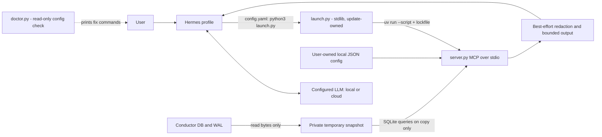

# Conductor Status Bot

A portable Hermes profile distribution that reports local Conductor session status
through one **local stdio MCP tool**. No remote MCP service, Conductor account
credentials, message sending, task mutations, or source SQLite connections.

## Architecture



The MCP server exposes only `conductor_status`, with an empty input schema and
`additionalProperties: false`. It rejects SQL, paths, commands, and unknown tools.
It never opens a listening port. Hermes registers it as
**`mcp__conductor_status__conductor_status`** (double underscores) — confirm from
`<profile>/logs/agent.log`: `registered 1 tool(s): mcp__conductor_status__conductor_status`.

### Launch design (0.3+): nothing launch-critical in the preserved file

`hermes profile update` **preserves `config.yaml`** (it holds your model/provider
settings). So the shipped config contains exactly one launch-relevant line — the path
to `skills/conductor-status/scripts/launch.py` — and nothing else a release could
need to change:

```yaml
mcp_servers:
  conductor_status:
    command: python3
    args: ["${userHome}/.hermes/profiles/conductor-status-bot/skills/conductor-status/scripts/launch.py"]
```

`launch.py` is stdlib-only (runs on macOS system `python3`), is distribution-owned and
overwritten on every update, locates `uv` (PATH, `~/.local/bin`, `~/.cargo/bin`,
`~/.brew/bin`, Homebrew, `/usr/local/bin`), drops any stale `CONDUCTOR_STATUS_HOME`,
and starts `server.py` with the adjacent `server.py.lock`. How the server starts is
therefore a property of the release, not of the user's config.

`doctor.py` is a read-only check of that config. It names each problem and prints
copy-pasteable `~/.local/bin/hermes -p <profile> config ...` commands; it never edits
the file itself.

## Requirements

- Hermes with profile distributions and native MCP support. Tested with Hermes
  **0.21.3**, source commit `3dae1f7335371ca4b015cdf5336db41868485153`.
- `git`, `uv` (on PATH or in one of the locations above), and Python **3.11 or newer**
  for the server (uv provisions it); the launcher and doctor run on any Python 3.9+.
- The Python MCP SDK available in Hermes itself (use `hermes setup` if MCP support
  is missing). The separate server uses **mcp==2.2.0** via uv script metadata.
- Local read permission for the Conductor database and WAL, and writable profile
  scratch/cache directories. Do not run as administrator to bypass permissions.

The server's bundled `server.py.lock` pins transitive packages and artifact hashes.
`uv run --script` honours that adjacent lockfile automatically and refuses an
inconsistent one, so `--locked` is not passed (it only warns next to `--no-project`).
First launch may download Python or dependencies; this is package provisioning, not
transmission of Conductor data. After provisioning, uv can use its cache. An offline
machine needs a prepared cache.

## Install

**Run these from an external terminal (Terminal.app, iTerm), not from the desktop
app's chat.** The CLI embedded in the desktop app reports version `unknown` and fails
the manifest's `hermes_requires` check. `hermes` may not be on PATH in a fresh shell;
the installer puts it at `~/.local/bin/hermes`.

```sh
~/.local/bin/hermes profile install github.com/KRRySS/conductor-status-bot
~/.local/bin/hermes -p conductor-status-bot setup
~/.local/bin/hermes -p conductor-status-bot chat
```

The manifest's default profile name is `conductor-status-bot`. It does **not** replace
Hermes's built-in `default` profile. To choose a different name, install with
`--name`, then run the doctor once — the shipped config names the default profile
directory, Hermes cannot rewrite a preserved config, and the doctor prints the one
`config set` you need:

```sh
~/.local/bin/hermes profile install github.com/KRRySS/conductor-status-bot --name local-status
python3 ~/.hermes/profiles/local-status/skills/conductor-status/scripts/doctor.py
# apply the printed commands, then:
~/.local/bin/hermes -p local-status setup
~/.local/bin/hermes -p local-status chat
```

Configure your own model/provider. No credentials, provider account, previous
sessions, or memories ship in this repository. Installation requires trusting the
reviewed source; distributions are executable configuration, not a sandbox.

During development, install the checkout instead of GitHub:

```sh
~/.local/bin/hermes profile install ./conductor-status-bot --name local-status
```

Local-source updates read that same checkout; GitHub installs record the GitHub
source. The tested installer normalizes GitHub shorthand to HTTPS and tracks the
repository's default branch. A `#tag` suffix is **not** supported by the installer.

## Configuration and paths

**Why not `${HERMES_HOME}` in `config.yaml`:** Hermes interpolates `${VAR}` placeholders
from the process environment, not from the profile that owns the file. Under the
desktop app or a multiplexed gateway that is the *launch* profile's home, typically
`~/.hermes`, where this skill is not installed — the server then fails with "can't
open file ... No such file or directory". `${userHome}` is a context variable Hermes
resolves to the real user home, and the profile directory name is fixed by the
manifest, so the shipped path is stable across restarts, multiplexing and reinstalls.

The server derives its profile root from its own installed file location and needs
no environment variable. `CONDUCTOR_STATUS_HOME` is a legacy optional cross-check;
`launch.py` drops it, so it only matters if you bypass the launcher.

| Path, relative to active profile | Purpose |
| --- | --- |
| `config.yaml` | Hermes native MCP launch config (one path to `launch.py`); provider settings live here too |
| `skills/conductor-status/scripts/launch.py` | Stdlib launcher; the only thing `config.yaml` points at |
| `skills/conductor-status/scripts/doctor.py` | Read-only config check; prints fix commands |
| `skills/conductor-status/scripts/server.py` (+ `.lock`, `status.py`, `privacy.py`) | MCP server, reader, redactor, dependency lock |
| `local/conductor-status.json` | Optional user-owned database path and event opt-in |
| `cache/scratch/conductor-status-*` | Private temporary DB/WAL copies, removed after each normal call |
| `logs/mcp-stderr.log`, `logs/agent.log` | First places to look when the tool is missing |
| `.env`, `auth.json` | Your provider credentials, managed locally; never distributed |

On macOS the default database path is
`~/Library/Application Support/com.conductor.app/conductor.db`.
On other platforms, explicitly configure a compatible database; Conductor's
non-macOS storage layout is **not assumed or verified**.

Create `<profile>/local/conductor-status.json` if needed:

```json
{
  "db_path": "~/Library/Application Support/com.conductor.app/conductor.db",
  "include_events": false
}
```

Only these two settings are accepted. After `~` expansion, `db_path` must be an
absolute local path. Settings are re-read on every tool call. For a custom profile,
put this file under that profile's `local/`, not in the source checkout. Database
paths are local settings, not secrets or model-supplied MCP arguments. Use
`~/.local/bin/hermes -p <profile> config set ...` for Hermes config changes rather
than editing an active Hermes config by hand.

**Event text is off by default.** To include up to four recent text events per
session, set `include_events` to `true` in the local JSON file. This helps explain
reported progress but substantially increases privacy exposure. Titles, branches,
workspace names, model names and status labels are still returned with events off.

## Privacy and read-only boundaries

**Local MCP does not mean local inference.** Hermes can send tool results—including
Conductor metadata and opted-in conversation excerpts—to your configured cloud LLM.
Hermes may also persist those results in its own sessions/logs. Use an approved
local model if your policy requires local processing; verify the whole Hermes
configuration and provider path, not just this server.

The redactor masks common API-token formats, Bearer tokens, obvious password/token
assignments, JWT-shaped strings, private-key blocks, URL passwords, and common home
path prefixes. It runs on returned strings before truncation. **It is best effort,
not reliable secret detection, full PII removal, or a guarantee against leakage.**
Unlabelled secrets, unusual encodings and sensitive business context can survive.
Do not use the tool on data you are not authorized to disclose.

The server has fixed SQL and no mutation API. Unlike a direct SQLite `mode=ro`
connection, which can still interact with source SHM sidecars, this implementation
only reads source file bytes. It captures DB + WAL twice, checks metadata and byte
stability, refuses nonempty rollback journals, and retries up to three times. It
recovers/checks/queries **only a private disposable copy**. It never checkpoints,
opens a source SQLite connection, sends messages, or changes labels.

This capture is a conservative **best-effort live snapshot, not an atomic backup**.
A busy database can be refused. The source file contents and DB/WAL/SHM modification
times are checked in synthetic tests; normal filesystem access-time bookkeeping is
outside this guarantee. Copies contain raw data locally until removal and may
remain after forced termination/crash; they are inside a private temporary directory.
No claim of secure disk erasure is made. The server runs with the user's filesystem
permissions, not inside an OS sandbox. Hermes's other tools are not made read-only
by this distribution; the SOUL/skill instruct the assistant not to bypass this MCP.
Review/disable other toolsets separately if you require a stricter host boundary.

## Status semantics and limits

- Hidden sessions and archived workspaces are omitted. `all_sessions` counts the
  whole sessions table; `visible_sessions` counts the visible joined subset.
- At most 100 sessions, newest updated first; `sessions_truncated` reports omissions.
- Opted-in events: inspect up to 40 recent stored messages, return at most four text
  events per session. `events_are_partial` is always true. No full-history promise.
- Strings are redacted then capped at 6,000 characters with a truncation marker.
- A DB + WAL larger than 256 MiB is refused by the capture precheck. The double
  capture needs memory; this is not a streaming large-database reader.
- `manual_status`, `derived_status`, and agent `status` remain distinct. An idle
  agent or a final response does not prove the task succeeded. Done means marked
  done, not independently verified. Agent test claims remain attributed claims.
- A missing/incompatible/unreadable database returns `ok: false` and an MCP tool
  error, never a fabricated empty result. Error details omit raw paths/content.
- The schema adapter targets the tested sessions/workspaces/session_messages
  layout. Future Conductor schema changes may need an adapter update.

## Update

From an external terminal:

```sh
~/.local/bin/hermes profile update conductor-status-bot
~/.local/bin/hermes profile info conductor-status-bot
python3 ~/.hermes/profiles/conductor-status-bot/skills/conductor-status/scripts/doctor.py
```

Updates refresh the SOUL, bundled skill/scripts/lockfile and manifest. Hermes
preserves `config.yaml` and leaves `local/`, credentials, memories and sessions
untouched. **Restart the profile** (new session / restart the gateway or desktop
backend) after updating: the MCP subprocess is spawned at startup and running
sessions keep the old code. Then check `<profile>/logs/agent.log` for
`registered 1 tool(s): mcp__conductor_status__conductor_status`.

### Upgrading from 0.1.x or 0.2.x

Those releases' `config.yaml` launched `uv ... server.py` directly, 0.1.x with
`${HERMES_HOME}` and `CONDUCTOR_STATUS_HOME`. Because `config.yaml` is preserved on
update, the doctor is the migration: it detects every old shape and prints the exact
commands for your profile name and launcher path.

```sh
P=conductor-status-bot   # or your --name
~/.local/bin/hermes profile update $P
python3 ~/.hermes/profiles/$P/skills/conductor-status/scripts/doctor.py
# copy-paste the printed `config set` / `config unset` lines, then restart the profile
python3 ~/.hermes/profiles/$P/skills/conductor-status/scripts/doctor.py   # expect: OK
```

Do **not** use `--force-config` for this: it replaces the whole `config.yaml`,
including your model/provider block. The doctor's commands touch only
`mcp_servers.conductor_status.*`, so there is exactly one server entry afterwards
(no duplicate).

## Testing

All tests create synthetic SQLite fixtures. They never read a real Conductor DB,
copy real profiles/auth, invoke a model, or publish anything.

From the checkout:

```sh
uv run --no-project --with-requirements requirements-test.txt python -m unittest discover -s tests -v
```

This runs reader/privacy and real SDK stdio-client tests; the installer tests are
skipped unless the two Hermes paths below are supplied. For the complete suite with
an installed source checkout and its Python environment:

```sh
HERMES_SOURCE="$HOME/.hermes/hermes-agent" \
HERMES_PYTHON="$HOME/.hermes/hermes-agent/venv/bin/python" \
uv run --no-project --with-requirements requirements-test.txt python -m unittest discover -s tests -v
```

The installer tests each build a throwaway `HOME`, verify Hermes resolves the
isolated profiles root **before any install**, and then drive Hermes' **own MCP
client and tool dispatcher** (`discover_mcp_tools` + `handle_function_call`), so
"registered 1 tool(s)" and the returned JSON are Hermes' real behaviour, not a
re-implementation:

1. Fresh install under `--name ct-test`; doctor detects the default-name path,
   its printed commands are applied via `hermes config`; tool registers and answers.
2. Update over a profile carrying the **preserved 0.1.0 config** (`${HERMES_HOME}`,
   `CONDUCTOR_STATUS_HOME`, `--locked`, plus a `model:` block); doctor names all of
   them; after its commands the model block survives, exactly one server entry
   remains, tool registers and answers with redaction.
3. Desktop / multiplex shape: `HERMES_HOME` is the **default** home, the profile is
   bound through Hermes' context override, the whole HOME is relocated (spaces in
   the path); tool registers, returns `ok`/`read_at`/`counts`, source DB/WAL/SHM
   fingerprints unchanged, no temp copies left.

Wire tests cover default event suppression, opted-in redaction, no-argument schema,
rejected SQL/path/command arguments, unknown tools, missing-database errors,
profile discovery without any env var, the `CONDUCTOR_STATUS_HOME` mismatch guard,
DB/WAL/SHM immutability and temporary-copy cleanup. Unit tests cover retries,
WAL-only data, filters/counts/labels, changed sources, journals, capture bounds and
malformed schema. No credentials are needed for the test suite.

What is **not** covered: a live desktop-app session on a second machine. The
multiplex test reproduces the launch-home/profile split the desktop backend uses
(`set_hermes_home_override` with `os.environ["HERMES_HOME"]` at the default home),
not the Electron process itself.

## References

- Hermes profile distributions: https://hermes-agent.nousresearch.com/docs/user-guide/profile-distributions
- Hermes source: https://github.com/NousResearch/hermes-agent
- MCP Python SDK: https://github.com/modelcontextprotocol/python-sdk/tree/v2.2.0

Implementation compatibility was checked against Hermes's
`hermes_cli/profile_distribution.py`, `hermes_cli/profiles.py`,
`hermes_cli/plugins_discovery.py`, `hermes_cli/agent_plugins.py`,
`tools/mcp_tool_config.py`, `tools/mcp_tool_schema.py` and
`tools/mcp_tool_transport.py`, as well as the official distribution documentation.
See `CHANGELOG.md` for why the Agent Plugin (`${PLUGIN_ROOT}`) route was not taken.
This is an independent integration, not an endorsement by Conductor, Hermes, or MCP
maintainers.
